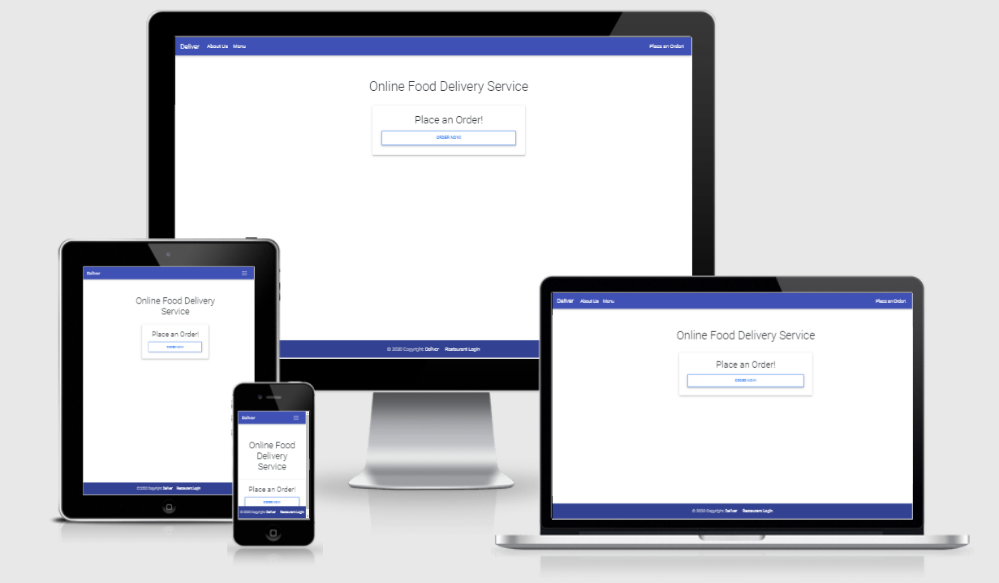
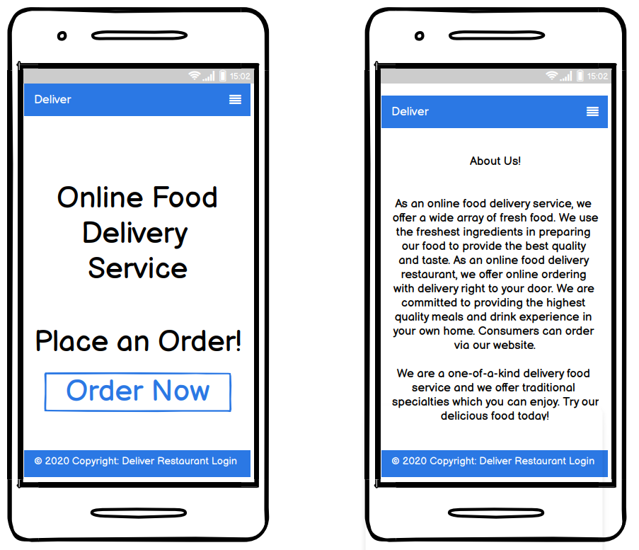
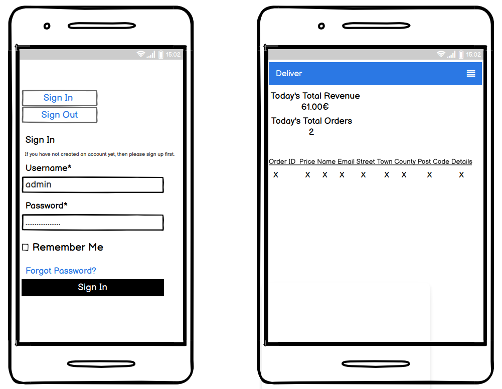

# Deliver

[Live application can be found here](https://fooddelivery7.herokuapp.com/)

This is a full-stack framework project built using Django, Python, HTML, CSS and JavaScript. This is a online delivery website designed to display menus to customers & allow them to order food online and have it deliveredd right to their door. This project has been built for educational purposes.

---
## UX

## Strategy
Using the core UX principles I first started with Strategy, thinking about the target audience for this online food delivery service & the features they would benefit from.

The target audience for 'Deliver' are:
- ALL ages starting from 18
- People that enjoy different varieties of food 
- People that enjoy eating from the comfort of their home

These users will be looking for:
- An informative website, with information that is easy-to-find 
- Up-to-date menus, with essential information such as price and an image of the what the food will look like 
- A quick and easy website to order food 
- The ability to make a user account
- A way to contact the delivery service

Due to the age group of the users, it is assumed that most users will be viewing the site on their mobile phones and therefore creating something responsive is integral to the design, I have used Bootstrap grids and elements & custom CSS to allow for this.

## User Stories
Please find all my defined user stories & their acceptance criteria [here](https://github.com/Ion71229/Milestone-4/issues)

1. As a user I can intuitively navigate through the site so that I can view desired content.
2. As a user I can get key information about the food delivery service.
3. As an admin user I can log in to see how much oders have been placed and how much revenue I'm making.
4. As an admin user I can sign in to add & remove items from the current menus so that I can make sure the website is up to date and accurately reflects what is being served in the restaurant.
5. As an admin user I can create, remove, update or delete food & drinks items from the database so that I can ensure items are accurate and able to be added to the menu on the website.
6. As a user I can register or log in so that I can order my food.
7. As a user I can easily see if I'm logged in or not so that I can choose to log in or log out depending on what I'm doing.
8. As a user I am prompted to register for an account so that I can create an account and receive the benefits from having a profile.
9. As a user I can log in so that I can auto-populate forms with my information on the site.
10. As a user I can view the food & drinks menu's separately so that I can easily find the information I'm looking for.
11. As a user I can easily find all of the relevant information about the menu items so that I can make informed decisions.
12. As a user I can find a navigation bar and footer so that I can see what content there is on the website.
13. As a user I can send a contact form to the delivery service so that I can receive additional information.
14. As a logged-in customer I can edit/delete food/drinks items I have coosen if I don't want to order.
15. As a admin I can edit my customer information so that I can make sure their details are up to date for any future communication when making a delivery.

## Scope
In order to achieve the desired user & business goals, the following features will be included in this release:

- Responsive navbar that will navigate to the various pages throughout the site
- Landing page with brief information about the restaurant and links to the menu and order page
- Menus page with starters, mains and dessert and also drinks
- When placing an order the user can add their details to where they would like the food to be delivered
- Register/login feature using Django allauth

## Structure
This website has been designed with simplicity in mind, each page only has key information on it so that the user can find what they want quickly without having to read through unnecessary things. I have separated each key feature to highlight its functionality to the user.

The website is made of three apps:

1. Website - core functionality
2. Menus - menu display
3. Place an order - for delivery 

### Databases

The menu requires database to store information so I have built 3 custom models. 

### Menus
MenuItem is the model name for the menus app, this contains both food and drink items. Each item has a name, description and price.

### Place an order
OrderModel allows users to select what items they would like to order for delivery. Here users can input their details to order food and drink right to their door. Then the order will be submitted and a summary of your order will appear. It will also tell the user to pay with cash on delivery. 

### Skeleton

Please note the actual website differs slightly from the original wireframes. 

The theme of simplicity follows through to the design, I've used bootstrap columns and rows to divide the pages and tried to keep the same layout throughout so that the user has a sense of ease when on the various pages.

### Surface
Initially, the colour palette I chose for this delivery service website was green and white. I wanted a 'clean' feel and based it on greens to keep in theme with Grow, nature plays a huge role in the design of the restaurant and the menu so I wanted there to be consistency. However, whilst building the website I felt the sole use of green made it feel a little flat so I chose to add pink to the colour scheme. This change between pink and green features often, on button hover, in the navbar & footer & menu headings. 

I chose the fonts 'Lobster' & 'Raleway', I wanted a bold/statement font to use for headings which is why I chose 'Lobster' and then 'Raleway' for the general content as it's easier to read for the user. I have used a class called `brand-text` for most instances of the word Grow and also for the menu and footer headings.
