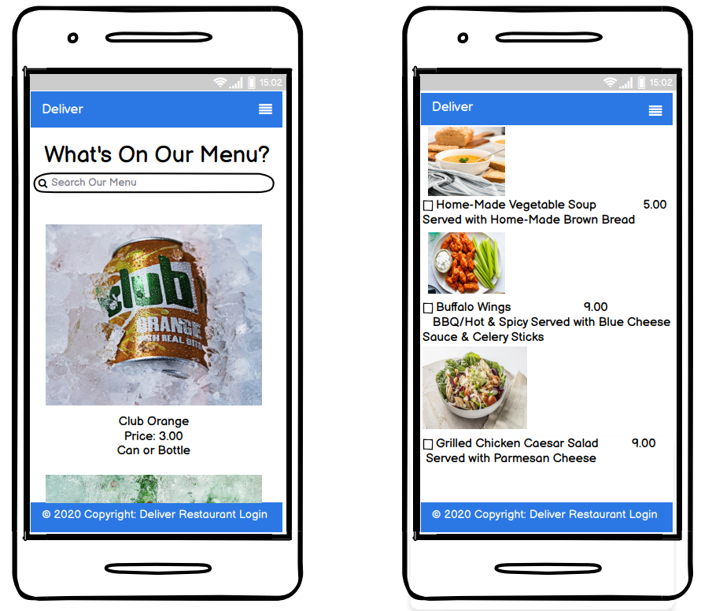
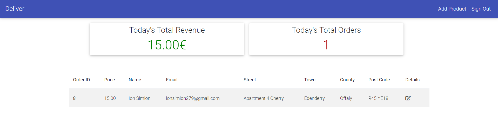

# Deliver

[Live application can be found here](https://fooddelivery7.herokuapp.com/)

This is a full-stack framework project built using Django, Python, HTML, CSS and JavaScript. This is a online delivery website designed to display menus to customers & allow them to order food online and have it deliveredd right to their door. This project has been built for educational purposes.

---
## UX
- [Strategy](#strategy)
- [User Stories](#userstories)
- [Scope](#scope)
- [Structure](#structure)
- [Homepage](#home-page)
- [Technologies Used](#technologies-used)
- [Testing](#testing)
- [Bugs and Fixes](bugs-and-fixes)
- [Deployment](#deployment)
- [Credits](#credits)
- [Acknowledgements](#acknowledgements)

## Strategy
Using the core UX principles I first started with Strategy, thinking about the target audience for this online food delivery service & the features they would benefit from.

The target audience for 'Deliver' are:
- ALL ages starting from 18
- People that enjoy different varieties of food 
- People that enjoy eating from the comfort of their home

These users will be looking for:
- An informative website, with information that is easy-to-find 
- Up-to-date menus, with essential information such as price and an image of the what the food will look like 
- A quick and easy website to order food 
- The ability to make a user account
- A way to contact the delivery service

Due to the age group of the users, it is assumed that most users will be viewing the site on their mobile phones and therefore creating something responsive is integral to the design, I have used Bootstrap grids and elements & custom CSS to allow for this.

## User Stories
Please find all my defined user stories & their acceptance criteria [here](https://github.com/Ion71229/Milestone-4/issues)

1. As a user I can intuitively navigate through the site so that I can view desired content.
2. As a user I can get key information about the food delivery service.
3. As an admin user I can log in to see how much oders have been placed and how much revenue I'm making.
4. As an admin user I can sign in to add & remove items from the current menus so that I can make sure the website is up to date and accurately reflects what is being served in the restaurant.
5. As an admin user I can create, remove, update or delete food & drinks items from the database so that I can ensure items are accurate and able to be added to the menu on the website.
6. As a user I can register or log in so that I can order my food.
7. As a user I can easily see if I'm logged in or not so that I can choose to log in or log out depending on what I'm doing.
8. As a user I am prompted to register for an account so that I can create an account and receive the benefits from having a profile.
9. As a user I can log in so that I can auto-populate forms with my information on the site.
10. As a user I can view the food & drinks menu's separately so that I can easily find the information I'm looking for.
11. As a user I can easily find all of the relevant information about the menu items so that I can make informed decisions.
12. As a user I can find a navigation bar and footer so that I can see what content there is on the website.
13. As a logged-in customer I can edit/delete food/drinks items I have coosen if I don't want to order.
14. As a admin I can edit my customer information so that I can make sure their details are up to date for any future communication when making a delivery.

## Scope
In order to achieve the desired user & business goals, the following features will be included in this release:

- Responsive navbar that will navigate to the various pages throughout the site
- Landing page with brief information about the restaurant and links to the menu and order page
- Menus page with starters, mains and dessert and also drinks
- When placing an order the user can add their details to where they would like the food to be delivered
- Register/login feature using Django allauth

## Structure
This website has been designed with simplicity in mind, each page only has key information on it so that the user can find what they want quickly without having to read through unnecessary things. I have separated each key feature to highlight its functionality to the user.

The website is made of three apps:

1. Website - core functionality
2. Menus - menu display
3. Place an order - for delivery 

### Databases

The menu requires database to store information so I have built 3 custom models. 

### Menus
MenuItem is the model name for the menus app, this contains both food and drink items. Each item has a name, description and price.

### Place an order
OrderModel allows users to select what items they would like to order for delivery. Here users can input their details to order food and drink right to their door. Then the order will be submitted and a summary of your order will appear. It will also tell the user to pay with cash on delivery. 

### Skeleton

Please note the actual website differs slightly from the original wireframes. 

The theme of simplicity follows through to the design, I've used bootstrap columns and rows to divide the pages and tried to keep the same layout throughout so that the user has a sense of ease when on the various pages.

### Surface
Initially, the colour palette I chose for this delivery service website was green and white.However, whilst building the website I felt the sole use of green made it feel a little flat so I chose to add blue to the colour scheme.

I chose the fonts Roboto & sans-serif; I wanted a bold/statement font to use for all body to be clear and understanding.

## Home page

**Navigation bar**: The navigation bar has links to all the active pages for the user and are clearly labelled, the menu option has Food or Drink menu. The 'about us' tells the user what the website aims to do for comsumers. The Naviation bar is a blue olour and the test is white. On the nav bar consumers can also place an order. When a nav link is hovered on it clearly indicates to the user what they are about to click on. 

The navigation bar is fully responsive and collapses on mobile screens to a hamburger icon, this easily allows the user to continue to use the navigation links without the need to press back on the browser. 

**Menu**: The menu allows consumers to browse and pick which food and drink they would like to have to order on the site. The owner has the option to edit and delete a product. 

**Edit Product**: This allows the owner to update prices, images and description. 

**Place an Order**: Consumers can place an order by clicking the place an order on the nav bar. Then it will re-direct to another page where the consumer can choose what they would like to order. After the consumer has choose what they would like to order, the consumer will be able to put in their details and where they would like the food to be delivered to. 

The page is then re-directed and the consumer is given a summary of wht they have ordered.

**Footer**: The footer displays restaurant login for the owner. 

**Restaurant login**: Available only for the owner of the website to see how much revenue and orders have been placed on the website.

The admin has full details about the consumer and the admin can marked as shipped when the order is ready for delivery.

**Add Product**: This allows the owner to add a product to the webiste. 

## Technologies Used

I have used several technologies that have enabled this design to work:

- [Django](https://www.djangoproject.com/)
    - Django is the framework that has been used to build the over project and its apps.
- [Python](https://www.python.org/)
    - Python is the core programming language used to write all of the code in this application to make it fully functional.
- [Bootstrap](https://getbootstrap.com/)
    - Used for creating responsive design.
- [Google Fonts](https://fonts.google.com/)
    - Used to obtain the fonts linked in the header, fonts used were Raleway and Lobster
- [Font Awesome](https://fontawesome.com/)
    - Used to obtain the icons used on the high scores and rules pages.
- [Google Developer Tools](https://developers.google.com/web/tools/chrome-devtools)
    - Used as a primary method of fixing spacing issues, finding bugs, and testing responsiveness across the project.
- [GitHub](https://github.com/)
    - Used to store code for the project after being pushed.
- [Git](https://git-scm.com/)
    - Used for version control by utilising the Gitpod terminal to commit to Git and Push to GitHub.
- [Gitpod](https://www.gitpod.io/)
    - Used as the development environment.
- [Heroku](https://dashboard.heroku.com/apps)
    - Used to deploy my application.
- [Grammarly](https://www.grammarly.com/)
    - Used to fix grammar errors across the project.
- [Pep8](http://pep8online.com/)
    - Used to test my code for any issues or errors.
- [Unicorn Revealer](https://chrome.google.com/webstore/detail/unicorn-revealer/lmlkphhdlngaicolpmaakfmhplagoaln?hl=en-GB)
    - Used to detect overflow of elements, which allowed me to quickly debug any issues.
- [W3C Markup Validation Service](https://validator.w3.org/) 
    - Used to validate all HTML code written and used in this webpage.
- [W3C CSS Validation Service](https://jigsaw.w3.org/css-validator/#validate_by_input)
    - Used to validate all CSS code written and used in this webpage.
- [JSHint](https://jshint.com/)
    - Used to validate JS code
- [AmIResponsive](http://ami.responsivedesign.is/)
    - Used to generate responsive image used in README file.
- [SQLite](https://www.sqlite.org/index.html)
    - I have SQLite to run my database tests locally.
- [PostgreSQL](https://www.postgresql.org/)
    - I have used Heroku's PostgreSQL relational database in deployment to store the data for my models.
---

## Testing

### Manual Testing

I have tested this project manually myself and have also had it peer-reviewed & tested by friends and family on multiple devices and screen sizes and using differernt browsers. 

### Code Validation
Automatic testing of HTML and CSS was checked using W3C Validator ensuring there were no errors or warnings within the code. When the site was ran through the validator there were no errors present.

- [W3C Markup Validation Service](https://validator.w3.org/) 
    - Used to validate all HTML code written and used in this webpage.

- [W3C CSS Validation Service](https://jigsaw.w3.org/css-validator/#validate_by_input)
    - Used to validate all CSS code written and used in this webpage.

- [JSHint](https://jshint.com/)
    - Used to validate JS code

- [Pep8](http://pep8online.com/)
    - Used to test my code for any issues or errors.

## Bugs and Fixes

- I noticed when deploying the app the first time it worked and after that it won't deploy.
- Menu item images would not load on 'heroku app'.
- I noticed after submitting the order, I never used the email form to send ordered submiited to consumer.
---
## Deployment

The main branch of this repository has been used for the deployed version of this application.

### Using Github & Gitpod

- To deploy my command-line interface application, I had to use the [Code Institute Python Essentials Template](https://github.com/Code-Institute-Org/python-essentials-template), as this enables the application to be properly viewed on Heroku using a mock terminal. 

    - Click the `Use This Template` button.
    - Add a repository name and brief description.
    - Click the `Create Repository from Template` to create your repository.
    - To create a Gitpod workspace you then need to click `Gitpod`, this can take a few minutes.
    - When you want to work on the project it is best to open the workspace from Gitpod (rather than Github) as this will open your previous workspace rather than creating a new one. You should pin the workspace so that it isn't deleted.
    -  Committing your work should be done often and should have clear/explanatory messages, use the following commands to make your commits:
        - `git add .`: adds all modified files to a staging area
        - `git commit -m "A message explaining your commit"`: commits all changes to a local repository.
        - `git push`: pushes all your committed changes to your Github repository.

### Forking:

- You can contribute to this project without affecting the main branch with the following steps:
1. Navigate to github repositores select this [repository](https://docs.github.com/en/get-started/quickstart/fork-a-repo)
2. On the right of the repository name you will find the fork button next to star and watch buttons.
3. Pressing said button will create a copy for you to use.

### Cloning:
- You can clone this repository to local device with the following steps:
1. Navigate to github repositores select this [repository](https://github.com/Ion71229/Milestone-3)
2. Under the repository name there is a green clone or download button.

### Steps to deploy on Heroku:

- The site is deployed on [heroku](https://www.heroku.com/)
- The steps I took to deploy on heroku are as follows:

    - Go to www.heroku.com and login or create an account. 
    - On the dashboard in the top right click on "new app".
    - Click settings. 
    - Under config vars add key: PORT and Value 8000.
    - Under buildpacks add python and node.js in that order. 
    - Go to deploy.
    - Link Heroku app to your github and search for the repository.
    - Click on deploy to build the app.

## Credits

Throughout the process of building this website, I have used various sources online to help me fix bugs & tackle problems, in addition to various modules to build the functionality of this website:

[Navbar](https://getbootstrap.com/docs/5.0/components/navbar/)

[To display multiple queryset](https://stackoverflow.com/questions/48872380/display-multiple-queryset-in-list-view)

[Coverage](https://coverage.readthedocs.io/en/6.2/)

[Crispy Forms](https://django-crispy-forms.readthedocs.io/en/latest/)

[Stack Overflow](https://stackoverflow.com/)

[Django Allauth](https://django-allauth.readthedocs.io/en/latest/installation.html)

[Testing](https://www.youtube.com/watch?v=0MrgsYswT1c)

## Acknowledgements
- I would like to thank my mentor Adegbenga Adeye and the slack community for their great advice, tips and the code review.
